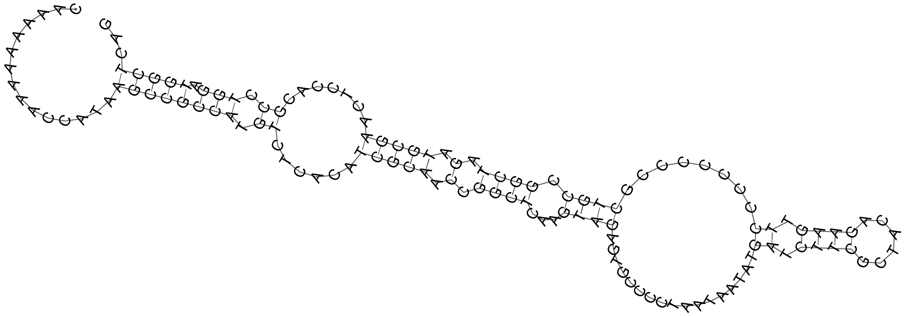

# This is a bioinformatic python package.

## 1. Install
```shell
pip install pybioinformatic --upgrade
```

## 2. Issue
### ImportError: libffi.so.7: cannot open shared object file: No such file or directory
```shell
# First use the following command to verify that the file exists in that path.
ls /usr/lib/x86_64-linux-gnu/libffi.so.7

# If libffi.so.6 is present on your system but libffi.so.7 is missing, you can try creating a soft link to an existing libffi.so.6 file.
ln -s /usr/lib/x86_64-linux-gnu/libffi.so.6 /usr/lib/x86_64-linux-gnu/libffi.so.7

# You can also install libffi7 with sudo grant.
sudo apt-get install libffi7
```

## 3. Usage example
### RNA secondary structure prediction.
```python
from pybioinformatic import Nucleotide

# Generate random nucleic acid sequence.
random_nucl = Nucleotide.random_nucl(name='demo', length=[100, 150], bias=1.0)

# Secondary structure prediction
ss, mfe = random_nucl.predict_secondary_structure('test/structure.ps')
print(ss, mfe, sep='\n')
```
```text
>demo length=135
CAAAAAAAAACCATAAGCCGCCATGTCTCACATCGCAACCGGCTCAAGTAGAGTGCCCCTAATAATATGATCTTCGCTACAGAAGTTCCCCCCCCGCTGCCGGCTAGATGCGAACTCCACGCCTGGATGGCTCAG
...............((((((((.((......(((((.(.((((...((((.................((.((((......)))).))........)))).)))).).))))).......)).))).)))))...
-27.299999237060547
```

****
**For more API reference, please refer to the follow user manual or source code.**
- [Bed API](https://github.com/wenlinXu-njfu/Leo/blob/main/bed.md)
- [GenoType API](https://github.com/wenlinXu-njfu/Leo/blob/main/GenoType.md)
